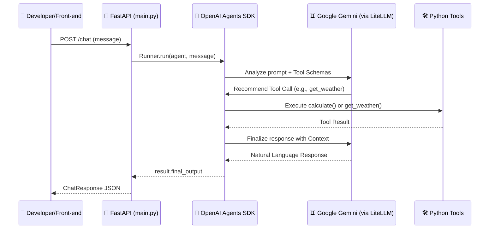

# 🤖 FastAPI OpenAI Agents SDK (Gemini Core)

An enterprise-ready, high-performance FastAPI wrapper for the **OpenAI Agents SDK**, orchestrated via **Google Gemini** and optimized with **uv** and **Docker**.

---

## 🏗 System Architecture

### 🔄 Request Lifecycle


### 🛰 Component Overview
| Component | Technology | Responsibility |
| :--- | :--- | :--- |
| **Runtime** | Python 3.11+ | High-speed execution environment |
| **Package Mgr**| [uv](https://github.com/astral-sh/uv) | Sub-second dependency resolution & venv management |
| **Web Layer** | FastAPI + Uvicorn | Async I/O handling, CORS, and SSE streaming |
| **Agent Engine**| OpenAI Agents SDK | Task orchestration and multi-tool coordination |
| **Brain** | Gemini 2.0 Flash | Advanced reasoning and function calling |

---

## ⚡ Quick Start

### 1. Environment Configuration
Create a `.env` file in the root directory:
```env
GEMINI_API_KEY=your_secret_key_here
```

### 2. Local Development (The "uv" Way)
```bash
# Install uv if you haven't (https://astral.sh/uv)
uv venv
source .venv/bin/activate
uv sync
python main.py
```

### 3. Containerized Execution
```bash
# Build and run with hot-reloading capability
docker-compose up --build
```

---

## 🛠 Extension & Customization

### Adding New Tools
To add capabilities to the agent, define a function with the `@function_tool` decorator in `main.py`:

```python
@function_tool
def fetch_user_data(user_id: str) -> str:
    """Fetch user-specific data from the database."""
    # Logic goes here
    return "Data for " + user_id

# Register it in the agent definition
assistant_agent = Agent(
    ...,
    tools=[get_weather, calculate, fetch_user_data]
)
```

---

## 📡 API Reference for Frontend Developers

### **POST** `/chat`
Standard request-response for chat.

**Request:**
```json
{
  "message": "Calculate (50 * 2) + 10",
  "stream": false
}
```

**Response:**
```json
{
  "response": "The result is 110."
}
```

### **POST** `/chat/stream`
Server-Sent Events (SSE) for real-time token streaming.

**Client-side implementation:**
```javascript
const response = await fetch('/chat/stream', {
  method: 'POST',
  body: JSON.stringify({ message: "Hello!" })
});
const reader = response.body.getReader();
// Decode the stream...
```

---

## 🐳 Docker Strategy
- **Base Image**: `python:3.11-slim` for minimal footprint.
- **Dependency Handling**: `uv sync` ensures immutable, locked builds.
- **Development**: Docker Volumes enable live-reloading during code edits.
- **Performance**: Bytecode compilation enabled via environment flags.

---

## 🛤 Roadmap
- [ ] Integration with Dapr for state management.
- [ ] Multi-agent orchestration (handovers).
- [ ] Persistence layer for chat history.
